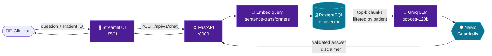

<div align="center">


<br/>

**A privacy-first, guardrailed RAG system that answers clinical questions strictly from a patient's own record.**

<br/>


[✨ Features](#-key-features) · [🧠 How it works](#-how-it-works) · [🗂️ Structure](#️-project-structure) · [🚀 Quick start](#-quick-start) · [☁️ Deployment](#️-deployment-on-google-cloud) · [🗺️ Roadmap](#️-roadmap)

</div>

---

> [!WARNING]
> **Research prototype, not a medical device.** Outputs are AI-generated summaries and must never be used for diagnosis or treatment decisions.

## ✨ Key Features

| | Feature | What it does |
|:-:|---|---|
| 🎯 | **Grounded answers** | Responds only from retrieved record context. If a fact is missing (e.g. a drug is listed but no dose is recorded), it says so instead of guessing. |
| 🔒 | **Patient-scoped retrieval** | Vector search is locked to one Patient ID, so one patient's data cannot leak into another's answer. The UI shows the active scope in the sidebar. |
| 🛡️ | **Guardrails on every reply** | [NVIDIA NeMo Guardrails](https://docs.nvidia.com/nemo/guardrails/) blocks unauthorized clinical recommendations and appends a safety disclaimer. |
| 🕵️ | **PII protection** | [Microsoft Presidio](https://microsoft.github.io/presidio/) plus a [spaCy](https://spacy.io) `en_core_web_lg` model for detecting and anonymizing identifiers. |
| ⚡ | **Fast open-weight inference** | `openai/gpt-oss-120b` served through the [Groq API](https://console.groq.com/docs). |
| 🧩 | **Decoupled architecture** | [FastAPI](https://fastapi.tiangolo.com) backend and [Streamlit](https://streamlit.io) frontend communicate over a clean HTTP API. |

## 🧠 How It Works



<details>
<summary><b>📋 Step-by-step request path</b></summary>

1. **Ask.** The user picks a patient in the sidebar and submits a question.
2. **Call.** The UI sends `POST /api/v1/chat` to the FastAPI backend.
3. **Embed.** The question is vectorized with a [sentence-transformers](https://www.sbert.net) model.
4. **Retrieve.** A similarity search runs on [pgvector](https://github.com/pgvector/pgvector), filtered by Patient ID *before* ranking.
5. **Generate.** Retrieved passages and the question go to the LLM with instructions to answer strictly from context.
6. **Guard.** NeMo Guardrails refuses or rewrites disallowed clinical advice and appends `⚠️ AI generated summary. Do not use for diagnostic purposes.`
7. **Return.** The validated answer is displayed in the UI.

</details>

## 🧰 Tech Stack

| Layer | Technology |
|---|---|
| 🖥️ Frontend | [Streamlit](https://streamlit.io) |
| ⚙️ Backend | [FastAPI](https://fastapi.tiangolo.com) served by [Uvicorn](https://www.uvicorn.org) |
| 🗄️ Vector store | [PostgreSQL](https://www.postgresql.org) + [pgvector](https://github.com/pgvector/pgvector) via [SQLAlchemy](https://www.sqlalchemy.org) and [psycopg 3](https://www.psycopg.org/psycopg3/) |
| 🔢 Embeddings | [sentence-transformers](https://www.sbert.net) (PyTorch, Hugging Face Transformers) |
| 🤖 LLM | `openai/gpt-oss-120b` on [Groq](https://console.groq.com/docs) |
| 🛡️ Guardrails | [NeMo Guardrails](https://docs.nvidia.com/nemo/guardrails/) |
| 🕵️ PII | [Presidio](https://microsoft.github.io/presidio/) Analyzer and Anonymizer, [spaCy](https://spacy.io) |
| 📊 Utilities | pandas, NumPy, python-dotenv, requests |
| ☁️ Hosting | Google Cloud Compute Engine, Ubuntu 22.04 LTS |

Pinned versions live in [`requirements.txt`](requirements.txt); a [uv](https://docs.astral.sh/uv/) workflow is described in [`uv_instructions.txt`](uv_instructions.txt).

## 🗂️ Project Structure

```text
Secure-EHR-Insight-Clinical-Validator/
├── 📁 assets/                # README banner and images
│   └── banner.svg
├── 📁 data/                  # EHR source data and derived artifacts (keep real PHI out of Git)
├── 📁 instructor_notes/      # Supervision notes and design rationale
├── 📁 scripts/               # Helpers: ingestion, embedding, DB setup
├── 📁 src/
│   ├── 📁 api/
│   │   └── 🐍 main.py        # FastAPI app → POST /api/v1/chat
│   ├── 📁 ui/
│   │   └── 🐍 app.py         # Streamlit frontend, patient selector, chat view
│   └── ...                   # Retrieval / vector search, guardrails config, PII utilities
├── 📄 .gitignore
├── 📄 README.md              # You are here
├── 📄 requirements.txt       # Pinned Python dependencies
└── 📄 uv_instructions.txt    # Setup notes for the uv package manager
```

> [!NOTE]
> `src/api/main.py` and `src/ui/app.py` are the two entry points. Adjust the `src/` sub-tree to match your actual module names.

## 🚀 Quick Start

### Prerequisites

- 🐍 Python 3.10+
- 🐘 PostgreSQL 14+ with the [pgvector extension](https://github.com/pgvector/pgvector#installation)
- 🔑 A [Groq API key](https://console.groq.com/keys)
- 💾 About 4 GB free disk (PyTorch, spaCy model, embedding weights)

### 1. Install

```bash
git clone https://github.com/Raghav0079/Secure-EHR-Insight-Clinical-Validator.git
cd Secure-EHR-Insight-Clinical-Validator

python3 -m venv venv
source venv/bin/activate          # Windows: venv\Scripts\activate

pip install --upgrade pip
pip install -r requirements.txt
```

If the `en_core_web_lg` wheel fails to install, run `python -m spacy download en_core_web_lg` instead.

### 2. Configure

Create a `.env` in the project root (never commit it):

```env
# Database
DB_HOST=localhost
DB_PORT=5432
DB_NAME=ehr_db
DB_USER=ehr_user
DB_PASSWORD=change_me

# LLM
GROQ_API_KEY=your_groq_api_key
LLM_MODEL=openai/gpt-oss-120b

# Backend URL used by the Streamlit UI
API_URL=http://localhost:8000
```

> [!TIP]
> Variable names above are a template; match them to what `src/` reads via `python-dotenv`.

### 3. Set up the database

```bash
sudo -u postgres psql
```

```sql
CREATE USER ehr_user WITH PASSWORD 'change_me';
CREATE DATABASE ehr_db OWNER ehr_user;
\c ehr_db
CREATE EXTENSION IF NOT EXISTS vector;
```

Then run the ingestion script from `scripts/` to chunk, embed, and insert the clinical notes with their Patient IDs.

### 4. Run

Start the backend and frontend as **two separate processes**; the UI cannot answer until the API is up.

```bash
# Terminal 1 – FastAPI backend
source venv/bin/activate
uvicorn src.api.main:app --host 0.0.0.0 --port 8000 --reload
```

```bash
# Terminal 2 – Streamlit UI
source venv/bin/activate
streamlit run src/ui/app.py --server.address=0.0.0.0 --server.port=8501
```

| Service | URL |
|---|---|
| 🖥️ Streamlit UI | http://localhost:8501 |
| ⚙️ FastAPI | http://localhost:8000 |
| 📖 Interactive API docs | http://localhost:8000/docs |

## 🔌 API Reference

### `POST /api/v1/chat`

<table>
<tr>
<td width="50%">

**Request** (align field names with your Pydantic model)

```json
{
  "patient_id": "10000032",
  "question": "What was the patient's last recorded dosage of Furosemide?"
}
```

</td>
<td width="50%">

**Response**

```json
{
  "answer": "Furosemide is listed in the record, but no explicit dosage is documented.\n\n⚠️ AI generated summary. Do not use for diagnostic purposes."
}
```

</td>
</tr>
</table>

## ☁️ Deployment on Google Cloud

Reference deployment: Compute Engine VM `ehr-validator-vm`, Ubuntu 22.04 LTS.

1. 🏗️ **Provision** the VM; install PostgreSQL, pgvector, Python 3, and `python3-venv`.
2. 🔐 **Set up SSH access.** If the login user and project owner differ, fix directory and `~/.ssh` permissions so the SSH user can read what it needs. Ownership mismatch was the main access issue during setup.
3. 📦 **Clone and install** under the project owner's home, create the `venv`, and export the `.env` values.
4. ▶️ **Start both servers** in separate SSH sessions (or use `tmux`, `screen`, or `systemd` for persistence).
5. 🚇 **Tunnel the ports** rather than exposing them. From Windows PowerShell:

```powershell
ssh -L 8501:localhost:8501 -L 8000:localhost:8000 <ssh-user>@<vm-external-ip>
```

Browse to `http://localhost:8501` (an Incognito window avoids stale sessions).

> [!CAUTION]
> Do not expose ports 8000 or 8501 publicly without authentication and TLS; the app fronts clinical data. See the [GCP firewall docs](https://cloud.google.com/firewall/docs/firewalls) to restrict access.

## ✅ Validation Results

| Check | Result |
|---|:-:|
| Vector store: PostgreSQL + pgvector stores and searches embedded EHR records | ✅ |
| Retrieval scope: context locked to Patient ID `10000032` | ✅ |
| Groundedness: recognized Furosemide in the record and correctly reported the missing dosage, with no hallucination | ✅ |
| Guardrails: response intercepted and the disclaimer appended | ✅ |
| Connectivity: `[Errno 111]` and HTTP 500 errors resolved by running backend and frontend concurrently | ✅ |

## 🛡️ Safety and Privacy Design

- 🎯 **Least context.** Retrieval is filtered by Patient ID before ranking, so the LLM never sees another patient's text.
- 🚫 **Refuse rather than advise.** Guardrails target prescriptive requests (dose changes, treatment choices).
- 🤷 **Abstain on missing data.** The model is instructed to state when the record lacks the requested fact.
- 🔑 **Secrets out of Git.** Keys and credentials live in `.env`.
- 🧪 **De-identified data only.** Develop and demo with public, de-identified, or synthetic records. Credentialed datasets usually forbid sending text to third-party APIs; check the data use agreement.
- ⚖️ **Compliance.** Real patient data needs HIPAA or India's DPDP Act work that this prototype does not provide.

## 🗺️ Roadmap

- [x] End-to-end RAG pipeline with patient-scoped retrieval
- [x] NeMo Guardrails with automatic safety disclaimer
- [x] Deployment and verification on Google Cloud
- [ ] **Multi-patient search:** UI selector to switch between one Patient ID and a global search, with an optional patient filter in the vector search module (needs stricter access control and clear UI labelling)
- [ ] Source citations: return retrieved snippets with each answer
- [ ] Authentication and role-based access
- [ ] Audit logging of queries and guardrail interventions
- [ ] Docker Compose packaging (UI, API, Postgres)
- [ ] Automated evaluation set for groundedness and guardrail recall

## 🩹 Troubleshooting

<details>
<summary><b>🔌 <code>[Errno 111] Connection refused</code> in the UI</b></summary>

The backend is not running or `API_URL` is wrong. Start uvicorn first, then the UI.

</details>

<details>
<summary><b>💥 HTTP 500 from <code>/api/v1/chat</code></b></summary>

Check the uvicorn logs. Common causes: missing `.env` value, database connection failure, or the `vector` extension not created.

</details>

<details>
<summary><b>🔐 <code>permission denied</code> over SSH</b></summary>

Directory ownership mismatch between the SSH user and the project owner. Fix with `chown`/`chmod`, or work as the owner.

</details>

<details>
<summary><b>🧬 spaCy model not found</b></summary>

Run `python -m spacy download en_core_web_lg` inside the virtual environment.

</details>

<details>
<summary><b>🚇 Tunnel works but the page is blank</b></summary>

Confirm Streamlit is bound to `0.0.0.0:8501` and both `-L` forwards are active.

</details>

## ⚕️ Disclaimer

This software is for research and educational purposes only. It is not a medical device, has not been clinically validated, and must not be used to make or support diagnostic or treatment decisions. Always consult a qualified clinician.

## 📜 License

Add a `LICENSE` file (MIT is a common choice for prototypes) and reference it here.

---

<div align="center">

**Built by [Raghav](https://github.com/Raghav0079)**

⭐ If this project helped you, consider starring the repo.

</div>
